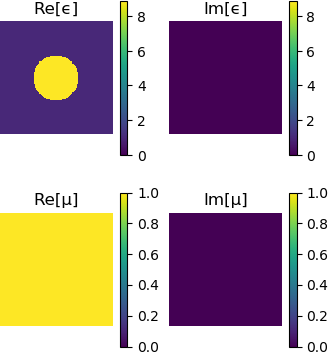
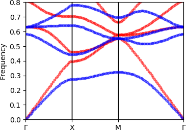

# Summary


The **P**lane-wave **E**xpansion **A**pproach to **C**haracterising **O**ptical
**C**rystals in **k**-space - otherwise known as
`Peacock.jl` - is a Julia package for studying
photonic crystals using the Plane Wave Expansion Method [@rumpf2006design].
A photonic crystal is a material whose optical properties arise from its
periodic structure [@yablonovitch1987inhibited; @john1987strong], and
`Peacock.jl` is named for the irridescent colours of peacock feathers which
arise not from pigmentation but from the scattering of light by photonic crystals
[@zi2003coloration], as shown in \autoref{fig:zoom}.

The response of a photonic crystal is strongest
when the periodicity of the structure is comparable to the wavelength of light.
For visible light, photonic crystals are built from components that are just a
few hundred nanometers in size. Advances in nanofabrication mean that 'designer'
photonic crystals can now be manufactured for unprecedented control over the
flow of light, with applications ranging from optical fibers
[@knight2003photonic] to photonic circuitry [@joannopoulos2008molding].
Photonic crystals are also a promising platform for materials known as
photonic topological insulators [@wu2015scheme; @wang2019band;
@blanco2019engineering]. These are the photonic analogue of the electronic topological
insulators [@kane2005z; @kane2005quantum; @bernevig2006quantum]
for which the 2016 Nobel Prize in Physics was awarded, and may allow
light to be guided around defects, impurities, and sharp corners without
backscattering [@rider2019perspective].

# Statement of need

![Example reproduction of a fragilely topological photonic crystal
[@blanco2019engineering]. (a) Unit cell of the photonic crystal.
(b-d) Out-of-plane component of the electric field of the first three
transverse-magnetic polarised modes at $\Gamma$. (e) Band diagram of the
transverse-magnetic polarised modes. (f) The Wilson loop spectrum of bands 2-3
wind, indicating non-trivial band topology. (g) The Wilson loop spectrum of the
full valence band space does not wind, indicating that bands 2-3 are 'fragilely'
topological. \label{fig:examples}](figures/examples.pdf)

`Peacock.jl` provides a user-friendly interface to calculate and analyse
the eigensolutions of 2D photonic crystals,
with support for non-orthogonal unit cells and inhomogeneous permittivity and/or
permeability. As well as the common tools for eigenmode analysis,
such as visualising the eigenmodes or the plotting the eigenvalues on band diagrams as
in \autoref{fig:examples}a-e, `Peacock.jl` also includes built-in using Wilson loop
methods [@blanco2020tutorial] to study the topology of photonic bands,
as in \autoref{fig:examples}f-g.
Although there exists open-source software to study photonic bands [@johnson2001block]
and to study topology in electronic bands [@gresch2017z2pack], to our knowledge
`Peacock.jl` is the first open-source package for studying the
band topology in photonic crystals.


# Example usage

## Installation

Before using `Peacock.jl` for the first time, you should install it using the built-in Julia package manager.
```julia
using Pkg
Pkg.add("Peacock")
```

After installation, the `Peacock.jl` can be loaded in Julia.
```julia
using Peacock
```

We'll also install and load `PyPlot` to control our figures.
```julia
using Pkg
Pkg.add("PyPlot")
using PyPlot
```


## Defining a photonic crystal

In this example we will reproduce a photonic crystal from chapter 5 of
[@joannopoulos2008molding]. It consists of dielectric cylinders
($\epsilon_\mathrm{cyl}=8.9, \mu_\mathrm{cyl}=1$) in air
($\epsilon_\mathrm{air}=1, \mu_\mathrm{air}=1$). The cylinders are arranged
on a square lattice with separation $a$, and each cylinder has a radius of $r=a/5$.

First, we must define the functions `epf(x,y)` and `muf(x,y)`, which return the
permittivity and permeability of the unit cell at $(x,y)$, where $(0,0)$
is the center of the unit cell. We choose to work in units of length where the
separation between cylinders is unity, $a=1$, such the radius of each
cylinder is 0.2.
```julia
# Permittivity
function epf(x,y)
    # equation of a circle with radius 0.2a
    if x^2+y^2 <= 0.2^2
        # dielectric inside the circle
        return 8.9
    else
        # air outside the circle
        return 1
    end
end

# Permeability is unity everywhere
function muf(x,y)
    return 1
end
```

Now we declare the lattice parameters. The cylinders are on a square lattice,
so our lattice vectors are orthogonal and of equal length $a$.
```julia
a1 = [1, 0]  # first lattice vector
a2 = [0, 1]  # second lattice vector
```

We must also give the resolution at which the geometry should be generated at.
```julia
d1 = 0.01  # resolution along first lattice vector
d2 = 0.01  # resolution along second lattice vector
```
A smaller value of `d1` or `d1` will result in a higher resolution grid.

Finally, we are ready to construct and visualise our `Geometry`.
```julia
geometry = Geometry(epf, muf, a1, a2, d1, d2)
plot(geometry)
```



## Setting up the solver

In this section we will create a `Solver` that approximates the geometry using a
truncated Plane Wave Expansion [@rumpf2006design]. The number of plane waves is determined by the
cutoff. Increasing the cutoff will increase the accuracy of the solution, but
low-contrast photonic crystals can be well approximated with a relatively
small basis of plane waves.
```julia
fourier_space_cutoff = 7
solver = Solver(geometry, fourier_space_cutoff)
```

Plotting the `Solver` lets you visualise how the `Geometry` has been approximated.
```julia
plot(solver)
```


## Plotting the band structure

When light passes through a photonic crystal, the frequency of the wave, $\omega$,
is related to its momentum, $\vec{k}$. It is common to plot the frequencies as
a function of momentum, $\omega(\vec{k})$, to produce a "band diagram"
(see [@joannopoulos2008molding]).

First, we must define the corners of a path through the Brillouin zone.
We can use `BrillouinZoneCoordinate` to attach a label to our coordinates,
so that our band diagram plots nicely.
```julia
G = BrillouinZoneCoordinate(  0,   0, "Γ")
X = BrillouinZoneCoordinate(1/2,   0, "X")
M = BrillouinZoneCoordinate(1/2, 1/2, "M")
ks = [G,X,M,G]
```

Now we can call `plot_band_diagram(solvers, ks, polarisation)` to produce our
diagram. If we provide the `dk` keyword argument, the path will be sampled so
that the spacing between $k$-points is `dk` or smaller. The crystal behaves
differently depending on the polarisation of light, so we plot the transverse
electric (TE) polarised bands in red and the transverse magnetic (TM) polarised
bands in blue.
```julia
figure(figsize=(4,3))
plot_band_diagram(solver, ks, TE, color="red",
            bands=1:4, dk=0.1, frequency_scale=1/2pi)
plot_band_diagram(solver, ks, TM, color="blue",
            bands=1:4, dk=0.1, frequency_scale=1/2pi)
ylim(0,0.8)
```


This reproduces figure 2 of chapter 5 of [@joannopoulos2008molding].


## Plotting a mode

Often it is useful to visualise the electric and magnetic fields in the crystal.
Here we show how to solve and plot the modes of a photonic crystal at a
particular $k$-point.

First, we call `solve`, which returns an array of `Mode`s.
```julia
modes = solve(solver, X, TM)
```

A `Mode` can be visualised using `plot(mode)`. By default the full Bloch wave is
plotted - set `bloch_phase=false` to plot the cell-periodic part of Bloch mode.
```julia
plot(modes[2], bloch_phase=true)
plot(modes[2], bloch_phase=false)
```


The out of plane field component is plotted - for TE and TM polarisations
this will be the magnetic and electric fields, respectively.
The titles of the figures are set automatically using the `label` of the `Mode`.

This reproduces figure 3 of chapter 5 of [@joannopoulos2008molding].
Note that `Peacock.jl` doesn't fix the phase of the solutions and your results may differ by a random phase.


## Peacock.Zoo

Finally, `Peacock.jl` includes a `Zoo` submodule of crystals from published
works. If you model a photonic crystal with `Peacock.jl`, please consider
contributing your geometry to the `Zoo` submodule to help others reproduce your work.


# Acknowledgements

S.J.P. acknowledges his studentship from the Centre for Doctoral Training on
Theory and Simulation of Materials at Imperial College London funded
by EPSRC Grant No. EP/L015579/1.
​
V.G. acknowledges the Spanish Ministerio de Economia y Competitividad for
financial support through the grant NANOTOPO (FIS2017-91413-EXP) and also the
Ministerio de Ciencia, Innovació n y Universidades through the grant MELODIA
(PGC2018-095777-B-C21).

# References